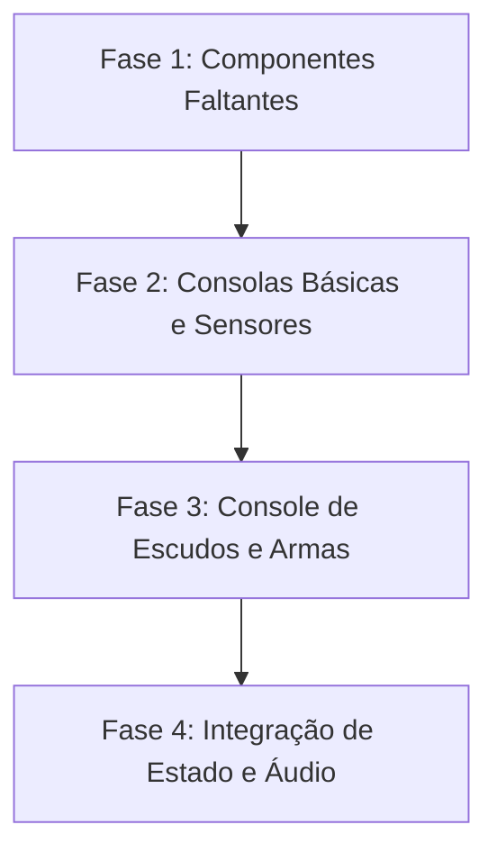

# Análise e Plano de Migração — SST LCARS Vue 3

Este documento apresenta a análise do estado atual da migração da interface e lógica do jogo **Super Star Trek (SST) - LCARS** para o **Vue 3 (Composition API / TypeScript)** e traça um plano de implementação para os componentes restantes.

---

## 1. Status Atual da Migração

Abaixo está o mapeamento dos consoles e painéis da versão legada (jQuery) em comparação com as versões criadas na aplicação Vue 3 (`vue-app`):

### Tabela de Status dos Módulos de Interface

| Módulo/Console Legado (`src/modules/`) | Componente Vue 3 (`vue-app/src/components/modules/`) | Status Atual | Observações / Lacunas |
| :--- | :--- | :--- | :--- |
| `game-hud.js` | `GameHud.vue` | **Concluído** | Contém o layout geral com `SituationPanel` e `TacticalConsole`. |
| `situation-panel.js` | `SituationPanel.vue` | **Parcial** | Falta integrar a reprodução de áudio do Red Alert e sincronizar dados com o estado do jogo. |
| `tactical-console.js` | `TacticalConsole.vue` | **Concluído** | Gerencia corretamente a exibição alternada das demais consolas. |
| `helm-console.js` | `HelmConsole.vue` | **Quase Concluído** | Interface visual desenhada (SVG pad e controles de dobra). Falta plugar a lógica de movimento espacial. |
| `engineering-console.js` | `EngineeringConsole.vue` | **Incompleto** | Apenas exibe o indicador de energia. Falta migrar a tabela de controle de danos (Damage Control). |
| `shield-console.js` | `ShieldConsole.vue` | **Stub (Apenas Título)** | Precisa receber a estrutura de controle de escudos e a grande ilustração SVG da nave Enterprise. |
| `weapons-console.js` | `WeaponsConsole.vue` | **Stub (Apenas Título)** | Precisa receber os seletores de phasers, temperatura e os botões de lançamento de torpedos fotônicos. |
| `navsensing-console.js` | `NavSensingConsole.vue` | **Stub (Apenas Título)** | Precisa receber os visualizadores de curto e longo alcance. |

### Componentes Primitivos e Widgets do LCARS SDK

- **Primitivos (Elements) Migrados**: `LcarsBar`, `LcarsBlock`, `LcarsButton`, `LcarsCap`, `LcarsColumn`, `LcarsComplexButton`, `LcarsElbow`, `LcarsHtmlTag`, `LcarsRow`, `LcarsSvg`, `LcarsText`, `LcarsTitle`, `LcarsWrapper`.
- **Widgets Migrados**: `SolidLevelBar`, `DefaultBracket`.
- **Elementos Faltantes**:
  1. `LcarsScanner` (equivalente ao elemento `scanner` legado, usado na grade 8x8 dos sensores).
  2. `DefaultBarFrame` (widget de moldura superior/inferior).
  3. `ScrollButton` (botões com setas de navegação vertical).

---

## 2. Análise Detalhada dos Consoles Pendentes

### 2.1. Shield Console (`ShieldConsole.vue`)
- **Desafio**: O arquivo legado [shield-console.js](file:///home/wendell/Projetos/sst-lcars/src/modules/shield-console.js) possui **188 KB** devido à injeção de uma string SVG gigante com a ilustração técnica da nave e das linhas de força dos escudos.
- **Solução Vue 3**: Limpar o SVG e inseri-lo diretamente no template Vue de forma legível, ou salvá-lo em um arquivo `.svg` separado em `assets/` e importá-lo como um componente dinâmico ou tag nativa. Isso tornará a manutenção do código infinitamente mais fácil.

### 2.2. Weapons Console (`WeaponsConsole.vue`)
- **Desafio**: Portar os bancos de phasers (temperatura e efetividade) e controles de torpedos.
- **Solução Vue 3**: Utilizar o `SolidLevelBar` existente para a temperatura dos phasers e replicar os botões de carregamento e travamento de alvo, criando reatividade local para o controle de temperatura.

### 2.3. NavSensing Console (`NavSensingConsole.vue`)
- **Desafio**: Exibir a grade do scanner de curto e longo alcance.
- **Solução Vue 3**: Implementar primeiro o elemento primitivo `<LcarsScanner />`. Ele gerará a grade CSS Flexbox 8x8 correspondente (com índices de linhas/colunas de 1 a 8) e aceitará um array de dados de quadrante para pintar os símbolos no grid (naves inimigas, estrelas, bases).

---

## 3. Plano de Implementação Proposto

O plano está estruturado em 4 fases sequenciais para garantir robustez, tipagem TypeScript correta e histórias correspondentes no Storybook.

### Fase 1: Primitivos e Widgets Faltantes (Estimativa: 1 a 2 dias)
1. **Criar `LcarsScanner.vue`**:
   - Grade Flexbox/Grid reativa baseado no `scanner.js` legado.
   - Receber propriedades `width` e `height` (default 8x8) e um mapa de itens.
2. **Criar histórias correspondentes**:
   - Validar o `LcarsScanner` no Storybook com diferentes estados de renderização.

### Fase 2: Consola de Sensores e Engenharia (Estimativa: 2 dias)
1. **Implementar `NavSensingConsole.vue`**:
   - Integrar o `LcarsScanner` para o scanner de curto alcance.
   - Replicar a tabela de setores e comandos de "Send Helm".
2. **Completar `EngineeringConsole.vue`**:
   - Adicionar a tabela reativa de controle de danos (Damage Control) usando blocos com cores baseadas no status de integridade.

### Fase 3: Console de Escudos e Armas (Estimativa: 2 dias)
1. **Implementar `ShieldConsole.vue`**:
   - Extrair a ilustração SVG técnica da Enterprise de `shield-console.js` e limpá-la.
   - Criar os controles de transferência energética reativos usando `SolidLevelBar`.
2. **Implementar `WeaponsConsole.vue`**:
   - Desenhar os bancos de phasers e controles de torpedos fotônicos.

### Fase 4: Integração de Estado Global e Sons (Estimativa: 3 dias)
1. **Criar Composable Central de Estado (`useGameState.ts`)**:
   - Gerenciar energia, stardate, coordenadas do jogador, quantidade de inimigos e integridade dos escudos.
   - Ligar os cliques e controles de todos os consoles a este estado reativo unificado.
2. **Sistema de Alertas e Áudio**:
   - Reimplementar o utilitário de áudio (`lcars_audio.js`) como um helper/composable nativo do Vue 3 para tocar os alertas de LCARS e sons de tiros/movimentos.

---

## 4. Próximos Passos Recomendados para Discussão

1. **Abordagem da Lógica do Jogo**: Devemos migrar a engine matemática do clássico SST agora, ou focar puramente em terminar a casca de interface visual reativa primeiro?
2. **SVG do Escudo**: Preferimos importar o SVG grande de forma inline no template ou colocá-lo como um asset separado?
3. **Gerenciador de Estado**: Iniciamos com um Composable reativo simples em TypeScript ou instalamos e estruturamos com Pinia?
